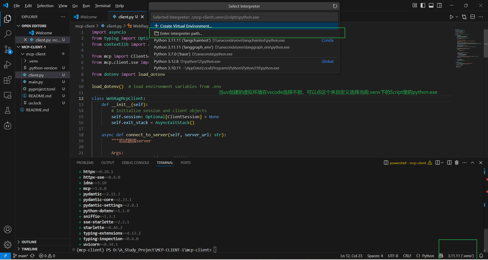

# 1.在linux环境下搭建uv环境

### 1. uv工具入门使用指南

#### 1.1 uv入门介绍

​        MCP开发要求借助uv进行虚拟环境创建和依赖管理。`uv` 是一个**Python 依赖管理工具**，类似于 `pip` 和 `conda`，但它更快、更高效，并且可以更好地管理 Python 虚拟环境和依赖项。它的核心目标是**替代** **`pip`****、****`venv`** **和** **`pip-tools`**，提供更好的性能和更低的管理开销。

**`uv`** **的特点**：

1. **速度更快**：相比 `pip`，`uv` 采用 Rust 编写，性能更优。
2. **支持 PEP 582**：无需 `virtualenv`，可以直接使用 `__pypackages__` 进行管理。
3. **兼容** **`pip`**：支持 `requirements.txt` 和 `pyproject.toml` 依赖管理。
4. **替代** **`venv`**：提供 `uv venv` 进行虚拟环境管理，比 `venv` 更轻量。
5. **跨平台**：支持 Windows、macOS 和 Linux。

#### 1.2 uv安装流程

**方法 1：使用** **`pip`** **安装（适用于已安装** **`pip`** **的系统）**

```Bash
pip install uv
```

**方法 2：使用** **`curl`** **直接安装**

如果你的系统没有 `pip`，可以直接运行：

```Bash
curl -LsSf https://astral.sh/uv/install.sh | sh
```

这会自动下载 `uv` 并安装到 `/usr/local/bin`。

#### 1.3 uv的基本用法介绍

​        安装 `uv` 后，你可以像 `pip` 一样使用它，但它的语法更简洁，速度也更快。注意，以下为使用语法示例，不用实际运行。

- **安装 Python 依赖**

```Bash
uv pip install requests
```

与 `pip install requests` 类似，但更快。

- **创建虚拟环境**

```Bash
uv venv myenv
```

等效于 `python -m venv myenv`，但更高效。

- **激活虚拟环境**

```Bash
source myenv/bin/activate  # Linux/macOS
myenv\Scripts\activate     # Windows
```

- **安装** **`requirements.txt`**

```Bash
uv pip install -r requirements.txt
```

- **直接运行 Python 项目**

如果项目中包含 `pyproject.toml`，你可以直接运行：

```Bash
uv run python script.py
```

这等效于：

```Bash
pip install -r requirements.txt
python script.py
```

但 `uv` 速度更快，管理更高效。

> 为什么MCP更推荐使用uv进行环境管理？

> MCP 依赖的 Python 环境可能包含多个模块，`uv` 通过 `pyproject.toml` 提供更高效的管理方式，并且可以避免 `pip` 的一些依赖冲突问题。此外，`uv` 的包管理速度远超 `pip`，这对于 MCP 这样频繁管理依赖的项目来说是一个很大的优势。

接下来我们尝试先构建一个 MCP 客户端，确保基本逻辑可用，然后再逐步搭建 MCP 服务器进行联调，这样可以**分阶段排查问题**，避免一上来就涉及太多复杂性。

### 2.MCP极简客户端搭建流程

#### 2.1 创建 MCP 客户端项目

```Bash
# 创建项目目录
uv init mcp-client
cd mcp-client
```

