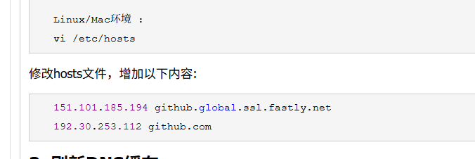
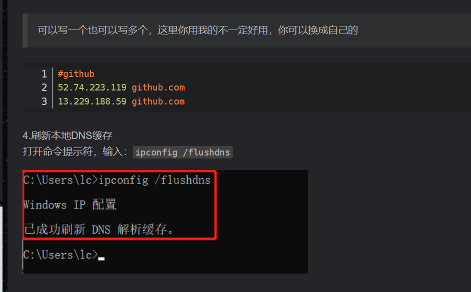

第一步：

ssh-keygen -t rsa -b 2048 -C "github账户的邮箱地址"


可以一直输入空格然后就ok

实测还是输入密码吧，输入那个github密码，不知道用不用输入，但是不输会报错

测试过了，以后gitclone和git push 输入密码的时候需要填这个密码，比如我在这个服务器上配置的密码

Digitmaster123

第二步：

查看这个文件：

一定要找.pub结尾的文件：

ssh-rsa AAAAB3NzaC1yc2EAAAADAQABAAABAQC+khJvO8NTrvZDCM2rqtzFxF7ek8/Jm2LoTTUxNkarzObJbD0LfM8wBn4iM0qTe79V9Tt240aEbSVdt7JJo/t+3dZZpnmmtLFeNulXEwGrtKR8war5BZOHoPIQrqGgIemZk81m0ryfaU50asou0LIa4d9qRitT90nkAUv3wrZBVVxLwsim5UqlH/WC5Ae4M3RaX3VncIih1JZfTYfcU2PzXTp8qewoW5+GqyGncKNRsBWLoKuOq8pjV7rjtztRXmCGq5vg2WViuisXrurD5r8U9IYgnUvjMnf7KbI+rhLbeEY0Mv3hEVTWoTua43z9ZQOj5ZOnAmDW+JwEWrTk3tLB hiwanghansan@gmail.com

b3BlbnNzaC1rZXktdjEAAAAABG5vbmUAAAAEbm9uZQAAAAAAAAABAAABFwAAAAdzc2gtcn
NhAAAAAwEAAQAAAQEAvpISbzvDU672QwjNq6rcxcRe3pPPyZti6E01MTZGq8zmyWw9C3zP
MAZ+IjNKk3u/VfU7duNGhG0lXbeySaP7ft3WWaZ5prSxXjbpVxMBq7SkfMGq+QWTh6DyEK
6hoCHpmZPNZtK8n2lOdGrKLtCyGuHfakYrU/dJ5AFL98K2QVVcS8LIpuVKpR/1guQHuDN0
Wl91Z3CIodSWX02H3FNj8106fKnsKFufhqshp3CjUbAVi6CrjqvKY1e647c7UV5ghqub4N
llYrorF67qw+a/FPSGIJ1L4zJ3+ymyPq4S23hGNDL94RFU1qE7muN8/WUDo+WTpwJg1vic
BFq05N7SwQAAA9C5MPxSuTD8UgAAAAdzc2gtcnNhAAABAQC+khJvO8NTrvZDCM2rqtzFxF
7ek8/Jm2LoTTUxNkarzObJbD0LfM8wBn4iM0qTe79V9Tt240aEbSVdt7JJo/t+3dZZpnmm
tLFeNulXEwGrtKR8war5BZOHoPIQrqGgIemZk81m0ryfaU50asou0LIa4d9qRitT90nkAU
v3wrZBVVxLwsim5UqlH/WC5Ae4M3RaX3VncIih1JZfTYfcU2PzXTp8qewoW5+GqyGncKNR
sBWLoKuOq8pjV7rjtztRXmCGq5vg2WViuisXrurD5r8U9IYgnUvjMnf7KbI+rhLbeEY0Mv
3hEVTWoTua43z9ZQOj5ZOnAmDW+JwEWrTk3tLBAAAAAwEAAQAAAQA9zHe+65X1erzwUxgD
LebnGT2clzlgSwwBghwYR94WE13Z/sgzA/faPpjDtXdfKVeMY/izHpO9GPnvkMT3vX4uj3
jV3LcBeQI1p7/2lTrK+EsJC/LKS2Uiq+4ju8W8/JJY08XdrMQvO8KN3R2QnevL7Oh6+aNO
WNh04HjGsTVSLPE7SH4rs4GN2Iznx2Olxg7QxGDpE4lWeRpjXxeMNNvR6wpNs6G00m7ubP
/tfNYRQ1VMToUb46OGeSLBn/NpFb39r1IuafJfwXxNW3kSZ54sPonnnUYFNIEpb2CrE/qS
xcUwbEPXrCEExKT9r7OORUqsCfkk/DGxMzfxJVfpNs07AAAAgDaPDx2gHQQmNsxEth+xVm
IfmZ03SAwpkigx/wo0F7urBl1UURKgVqWIXcuZHu6W5jEM33P9JkVA6UKwwWhV6R9ookdB
g95tU2EAO0EAPgJNXQA4yA1M2PrdxWmO3+K2IZBl6JFaR7Xtn8hgKof4D0rxolwNyz4Tne
IAYGyDJ1wYAAAAgQDP5BAWLAvBXxE30dt/0TCnfwkhaHpN1r/XhtcuIE5XvWnueMzwqfSd
fy3jQsjDMgazg2hkG1HHx47VupxTJ9G1dC9N6F7fX7tQRX6ZyQkcOGXpjXMo+/0aEu6acH
g8AcO3KEFFgCt4KjeYTXTxvkerYUzziXAcudlj0phAk2AxKwAAAIEA6qvqc3RqTb7yRiuz
3OmcPhgNClA0TUiBylNKvYFBlS82aBQZ/Ris3RMuK//oqxdviHMzCk7Zrtd/w2fReF9Orj
LtPwHRhpNN00a+vSOk3Tfj/s+uBDSBSseGxLu37ix8Ho/nn27H5Wt8E5/EeYDvEOv/kkHr
x/d00GqyJmBWncMAAAAWaGl3YW5naGFuc2FuQGdtYWlsLmNvbQECAwQF


服务器上github连不上

dns解析有问题，需要找另一个ip地址，也就是输入github.com，找另一个ip地址




然后把ip地址 + github.com

当访问GitHub的时候就会默认走这个ip地址。

然后重启刷新就可以了

在 Ubuntu 中修改 `/etc/hosts` 文件后，不需要重启整个系统，只需要刷新 DNS 缓存即可使更改生效。你可以使用以下几种方法：

1. 对于使用 systemd-resolved 的现代 Ubuntu 系统（Ubuntu 18.04 及更新版本）：

   ```
   sudo systemd-resolve --flush-caches
   ```

2. 对于使用 NetworkManager 的系统：

   ```
   sudo systemctl restart NetworkManager
   ```

3. 或者简单地重启网络服务：

   ```
   sudo systemctl restart networking
   ```

4. 在某些情况下，你可能还需要清除 nscd 缓存（如果已安装）：

   ```
   sudo service nscd restart
   ```

大多数情况下，修改 `/etc/hosts` 文件后更改会立即生效，无需执行任何命令。如果更改没有立即生效，尝试以上命令之一应该可以解决问题。




wsl@hcss-ecs-64dd:~$ git clone git@github.com:ZiHangChuDK/CGG_beta.git
Cloning into 'CGG_beta'...
The authenticity of host 'github.com (140.82.116.4)' can't be established.
ED25519 key fingerprint is SHA256:+DiY3wvvV6TuJJhbpZisF/zLDA0zPMSvHdkr4UvCOqU.
This key is not known by any other names
Are you sure you want to continue connecting (yes/no/[fingerprint])? yes
Warning: Permanently added 'github.com' (ED25519) to the list of known hosts.
Enter passphrase for key '/home/wsl/.ssh/id_rsa': 
remote: Enumerating objects: 788, done.
remote: Counting objects: 100% (197/197), done.
remote: Compressing objects: 100% (128/128), done.
remote: Total 788 (delta 99), reused 135 (delta 67), pack-reused 591 (from 1)
Receiving objects: 100% (788/788), 308.93 KiB | 541.00 KiB/s, done.
Resolving deltas: 100% (463/463), done.
