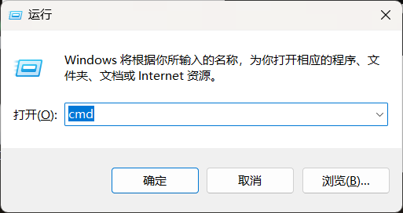
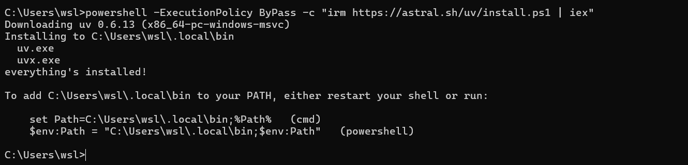
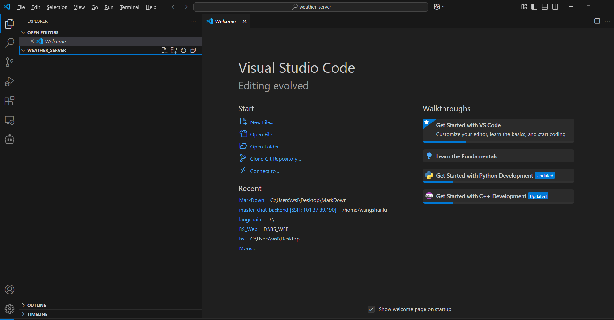
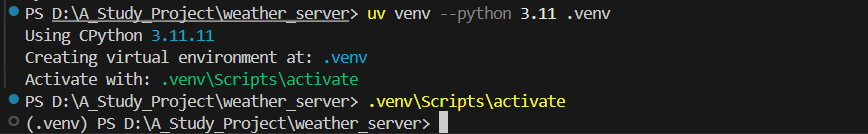
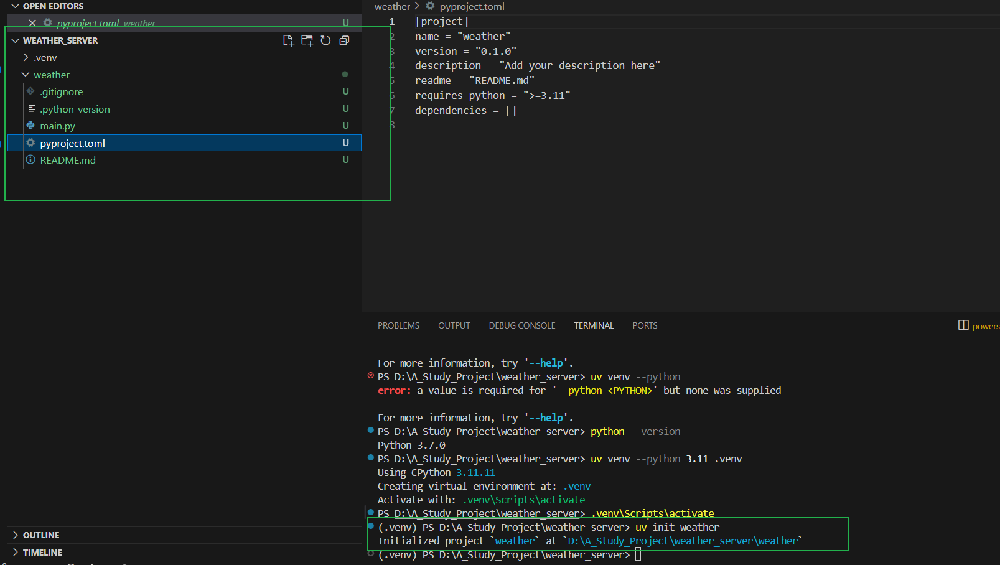
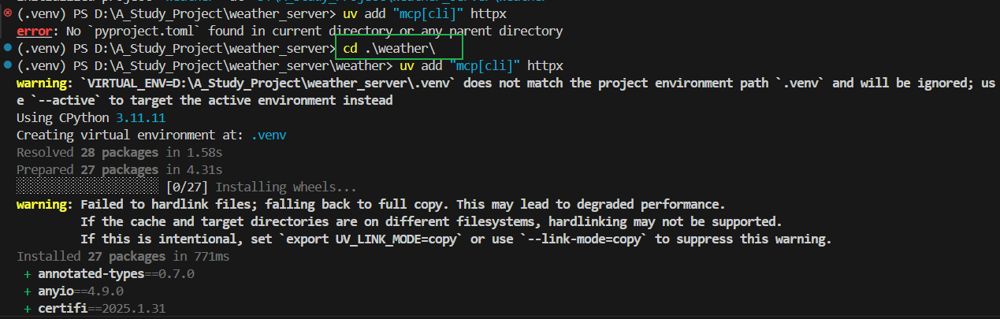
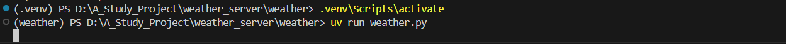

# 以后都用drawio


UV命令通常指的是在Python项目管理中使用的uv工具的命令。uv是一个由Astral团队开发的现代化Python工具链，旨在提高Python项目的开发和管理效率。它提供了比传统工具如pip更快的包安装速度、快速创建虚拟环境、原生支持pyproject.toml等功能。

首先安装uv

`powershell -ExecutionPolicy ByPass -c "irm https://astral.sh/uv/install.ps1 | iex"`

打开cmd



运行命令



在电脑上创建一个新的文件夹并用vscode打开：



首先创建一个虚拟环境：

uv venv --python 3.11 .venv  # 指定 Python 3.11



再输入命令：

.venv\Scripts\activate #即可激活环境

在终端输入uv init weather 来创建新项目



接下来在虚拟环境下安装依赖；


uv add "mcp[cli]" httpx

（注意首先要进入项目根目录,也就是创建的weather目录）




.venv\Scripts\activate

在项目根目录创建一个文件，weather.py

```python
from typing import Any
import httpx
from mcp.server.fastmcp import FastMCP

# Initialize FastMCP server
mcp = FastMCP("weather")

# Constants
NWS_API_BASE = "https://api.weather.gov"
USER_AGENT = "weather-app/1.0"

async def make_nws_request(url: str) -> dict[str, Any] | None:
    """Make a request to the NWS API with proper error handling."""
    headers = {
        "User-Agent": USER_AGENT,
        "Accept": "application/geo+json"
    }
    async with httpx.AsyncClient() as client:
        try:
            response = await client.get(url, headers=headers, timeout=30.0)
            response.raise_for_status()
            return response.json()
        except Exception:
            return None

def format_alert(feature: dict) -> str:
    """Format an alert feature into a readable string."""
    props = feature["properties"]
    return f"""
Event: {props.get('event', 'Unknown')}
Area: {props.get('areaDesc', 'Unknown')}
Severity: {props.get('severity', 'Unknown')}
Description: {props.get('description', 'No description available')}
Instructions: {props.get('instruction', 'No specific instructions provided')}
"""

@mcp.tool()
async def get_alerts(state: str) -> str:
    """Get weather alerts for a US state.

    Args:
        state: Two-letter US state code (e.g. CA, NY)
    """
    url = f"{NWS_API_BASE}/alerts/active/area/{state}"
    data = await make_nws_request(url)

    if not data or "features" not in data:
        return "Unable to fetch alerts or no alerts found."

    if not data["features"]:
        return "No active alerts for this state."

    alerts = [format_alert(feature) for feature in data["features"]]
    return "\n---\n".join(alerts)

@mcp.tool()
async def get_forecast(latitude: float, longitude: float) -> str:
    """Get weather forecast for a location.

    Args:
        latitude: Latitude of the location
        longitude: Longitude of the location
    """
    # First get the forecast grid endpoint
    points_url = f"{NWS_API_BASE}/points/{latitude},{longitude}"
    points_data = await make_nws_request(points_url)

    if not points_data:
        return "Unable to fetch forecast data for this location."

    # Get the forecast URL from the points response
    forecast_url = points_data["properties"]["forecast"]
    forecast_data = await make_nws_request(forecast_url)

    if not forecast_data:
        return "Unable to fetch detailed forecast."

    # Format the periods into a readable forecast
    periods = forecast_data["properties"]["periods"]
    forecasts = []
    for period in periods[:5]:  # Only show next 5 periods
        forecast = f"""
{period['name']}:
Temperature: {period['temperature']}°{period['temperatureUnit']}
Wind: {period['windSpeed']} {period['windDirection']}
Forecast: {period['detailedForecast']}
"""
        forecasts.append(forecast)

    return "\n---\n".join(forecasts)

if __name__ == "__main__":
    # Initialize and run the server
    mcp.run(transport='stdio')
```




按我的理解，uv就是一个包管理工具，是安装在电脑中的，而不是在某个环境中，安装完之后，使用uv init可以创建项目，项目里的pyproject相当于requirements，利用这个可以创建指定python版本的虚拟环境，这个命令在哪个文件夹执行会在哪个文件夹创建个.venv,,,,,,,,,,,,,,,,,,,,后面的这个.venv可以自定义名称，uv venv --python 3.11 .venv，应该在一个项目中可以有多个不同的环境，activate哪个就会用哪个，应该有默认的指向，等下试一下


`uv pip install -e .` 会读取 `[project.dependencies]` 安装依赖；`uv venv` 会检查 `requires-python` 的版本约束

uv的相关知识：

`pyproject.toml` 是 Python 项目的核心配置文件，用于定义项目的元数据、依赖项、构建系统要求等。它采用 **TOML**（Tom's Obvious, Minimal Language）格式，取代了传统的 `setup.py` 和 `requirements.txt`，成为现代 Python 工具链（如 `pip`、`poetry`、`uv`、`hatch`）的标准配置。以下是它的主要作用：

------

### **1. 定义项目元数据**

- **项目名称、版本、作者、描述**等基础信息。

- 示例：

  toml

  复制

  ```
  [project]
  name = "my-project"
  version = "0.1.0"
  description = "A fantastic Python project"
  authors = [{ name = "Your Name", email = "you@example.com" }]
  ```

------

### **2. 管理依赖项**

- **声明项目依赖**（替代 `requirements.txt`）：

  toml

  复制

  ```
  [project]
  dependencies = [
      "requests>=2.25.0",
      "numpy>=1.21.0",
  ]
  ```

- **可选依赖**（如开发或测试依赖）：

  toml

  复制

  ```
  [project.optional-dependencies]
  dev = ["pytest>=7.0", "black"]
  test = ["pytest-cov"]
  ```

------

### **3. 指定 Python 版本兼容性**

- 通过 `requires-python` 限制项目运行的 Python 版本范围：

  toml

  复制

  ```
  [project]
  requires-python = ">=3.8,<3.12"
  ```

------

### **4. 配置构建系统（Build System）**

- 定义构建项目时需要的工具（如 `setuptools`、`poetry`）：

  toml

  复制

  ```
  [build-system]
  requires = ["setuptools>=65.0.0", "wheel"]
  build-backend = "setuptools.build_meta"
  ```

- 工具链（如 `uv`、`pip`）会根据此配置安装构建依赖。

------

### **5. 支持现代工具链**

- **替代传统文件**：
  - `setup.py` → 使用 `pyproject.toml` 定义项目。
  - `requirements.txt` → 使用 `[project.dependencies]`。
  - `MANIFEST.in` → 通过 `[tool.setuptools]` 配置。
- **工具集成**：
  - `poetry`、`hatch`、`pdm` 等工具直接读取此文件管理项目。
  - `uv` 和 `pip` 在安装项目时会优先读取 `pyproject.toml`。