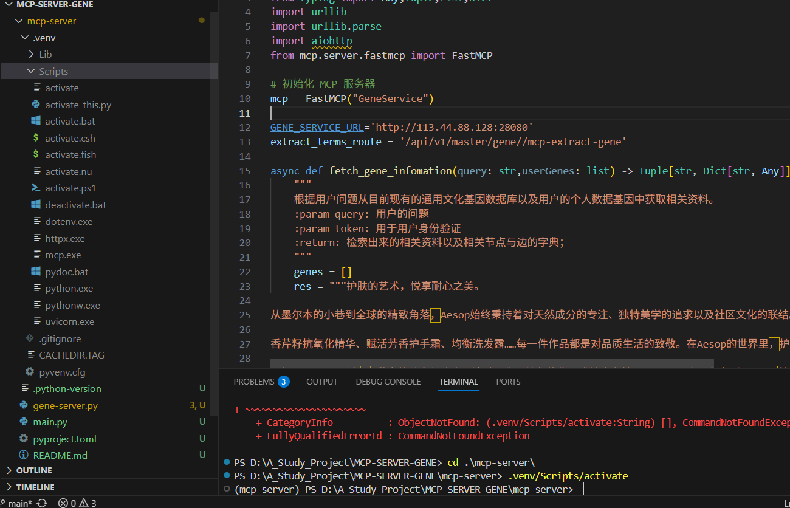
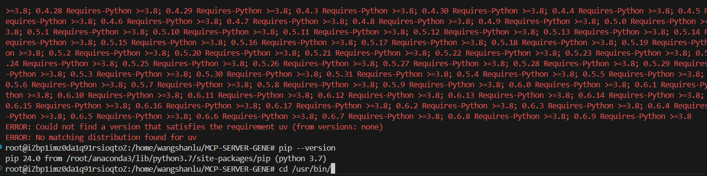
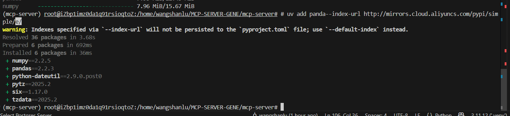

python的虚拟环境，vscode选择这个的方法：

pip的版本可能和输入python-v的版本不一致，

pip --version，想使用指定版本pip，可以去其目录下，不对，不要去指定目录，而是路径非常详细指定是哪个pip，不然就算在那个路径也不行。

# uv安装的慢，可以使用清华镜像源

uv add package_name --index-url https://pypi.tuna.tsinghua.edu.cn/simple

# 或者使用阿里云镜像（看你之前的输出似乎在使用阿里云）
uv add package_name --index-url http://mirrors.cloud.aliyuncs.com/pypi/simple/

